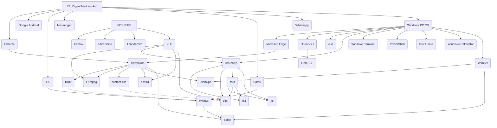

# Dependency Tree

```mermaid
flowchart TD
DMA[EU Digital Markets Act] --> CHROME(Chrome)
DMA --> ANDROID(Google Android)
DMA --> IOS(iOS)
DMA --> MESSENGER(Messenger)
DMA --> SAFARI(Safari)
DMA --> WHATSAPP(Whatsapp)
DMA --> WINDOWS(Windows PC OS)
FOSSEPS[FOSSEPS] --> FIREFOX(Firefox)
FOSSEPS --> LIBREOFFICE(LibreOffice)
FOSSEPS --> THUNDERBIRD(Thunderbird)
FOSSEPS --> VLC(VLC)
CHROME --> CHROMIUM(Chromium)
CHROMIUM --> BLINK(Blink)
CHROMIUM --> FFMPEG(FFmpeg)
CHROMIUM --> ZLIBCHROMIUM(custom zlib)
CHROMIUM --> DAV1D(dav1d)
CHROMIUM --> JSONCPP(JsonCpp)
CHROMIUM --> SQLITE(sqlite)
ZLIBCHROMIUM -.- ZLIB(zlib)
IOS --> WEBKIT(WebKit)
VLC --> FFMPEG
VLC --> LIBARCHIVE(libarchive)
VLC --> DAV1D
VLC --> ZLIB
WINDOWS --> EDGE(Microsoft Edge)
EDGE --> CHROMIUM
WINDOWS --> WINOPENSSH(OpenSSH)
WINOPENSSH --> LIBRESSL(LibreSSL)
WINDOWS --> CURL(curl)
WINDOWS --> LIBARCHIVE
WINDOWS --> WINTERMINAL(Windows Terminal)
WINDOWS --> POWERSHELL(PowerShell)
WINDOWS --> DEVHOME(Dev Home)
WINDOWS --> WINCALCULATOR(Windows Calculator)
WINDOWS --> WINGET(WinGet)
WINGET --> JSONCPP
WINGET --> SQLITE
LIBARCHIVE --> LZ4(lz4)
LIBARCHIVE --> ZLIB
LIBARCHIVE --> ZSTD(zstd)
LIBARCHIVE --> XZ(xz)
ZSTD --> XZ
ZSTD --> ZLIB
ZSTD --> LZ4
WEBKIT --> SQLITE
SAFARI --> WEBKIT
BLINK -.- WEBKIT
```
