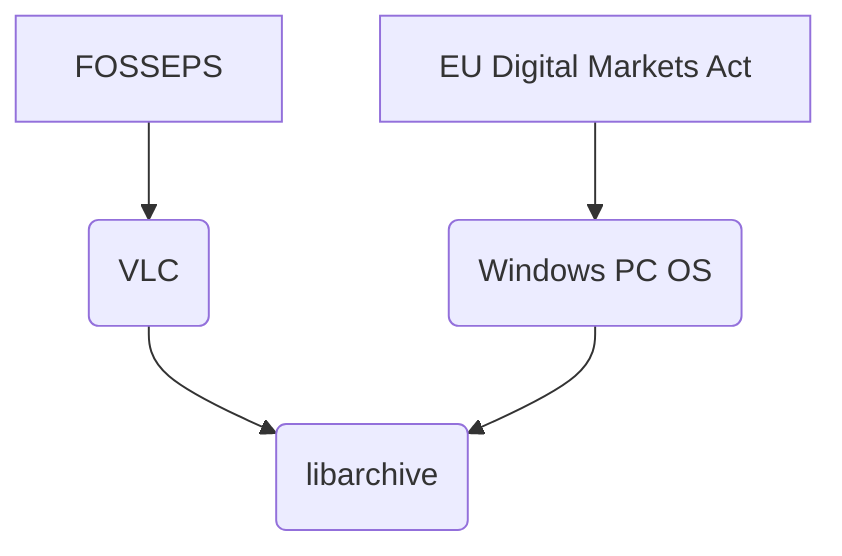

# libarchive

- [Homepage](https://www.libarchive.org/)
- [Build instructions](https://github.com/libarchive/libarchive/wiki/BuildInstructions)

# Usages

The libarchive project is used as a dependency within VLC and
Windows ZIP Tool.

## VLC

VLC can open archive files and play contained videos directly.
[Build instructions for contrib/libarchive.](https://github.com/videolan/vlc/blob/master/contrib/src/libarchive/rules.mak)

## Windows

Opening archive files like TAR through default settings in Windows
Explorer uses libarchive internally, according to developer blogs.
